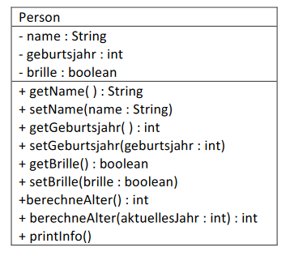

# Aufgabe 01
Dieses Beispiel zeigt die Definition einer Klasse ***Person*** mit den für uns relevanten **Eigenschaften (Attributen)**, sowie
Möglichkeiten um konkrete Werte abzufragen **(get-Methoden)** oder Werte zu ändern **(set-Methoden)**:

### Eigenschaften (Attribute):

- name ... ein Text (Datentyp String)
- geburtsjahr ... eine ganze Zahl (Datentyp int)
- brille ... true / false (Datentyp boolean)

### UML-Diagramm:



### Aufgabe (bitte die Reihenfolge einhalten und auf die Schreibweise achten):

- Zuerst ein neues BlueJ-Projekt „Aufgabe_01“ anlegen und darin eine Klasse „Person“ erzeugen.
(Bitte überlegen, wo das Projekt gespeichert wird, eventuell nochmal fragen!)
- Den von BlueJ erzeugten Beispielquelltext löschen - ausgenommen der Klassendefinition
*public class Person* und den äußeren Klammern *{}*
- Nun die Attribute definieren.
Bitte regelmäßig übersetzen (Compile), denn dadurch werden Fehler frühzeitig erkannt und der aktuelle
Stand des Projektes wird gespeichert!
- Ein *Person*-Objekt erzeugen und mit dem Inspektorfenster nachsehen, welche Werte den einzelnen
Attributen zugewiesen wurden!
- Jetzt die noch fehlenden get- und set-Methoden sowie die printInfo()-Methode schreiben und testen.
**Testen: Die Werte aller Attribute einzeln abfragen und ändern!
Werden die Änderungen tatsächlich durchgeführt?
Werden die Daten des Objekts korrekt auf das Terminal-Fenster ausgegeben?**
- Den Quelltext nun so ändern, dass ein Person-Objekt zu beginn die Werte
*name=“Paul“, geburtsjahr=1999, brille=true* erhält.

### Quelltext zur Klasse Person:

```java
public class Person {
    private String name = "Paul";
    private int geburtsjahr = 1999;
    private boolean brille = true;
    public String getName() {
        return this.name;
    }
    public void setName(String name) {
        this.name = name;
    }
    public int getGeburtsjahr() {
        return this.geburtsjahr;
    }
    public void setGeburtsjahr(int geburtsjahr) {
        this.geburtsjahr = geburtsjahr;
    }
    public boolean getBrille() {
        return this.brille;
    }
    public void setBrille(boolean brille) {
        this.brille = brille;
    }
    public int berechneAlter() {
        return 2020 - this.geburtsjahr;
    }
    public int berechneAlter(int aktuellesJahr) {
        return aktuellesJahr - this.geburtsjahr;
    }
    public void printInfo() {
        System.out.println("Name: " + getName());
        System.out.println("Brille: " + getBrille());
        System.out.println("Geburtsjahr: " + getGeburtsjahr());
        System.out.println("Alter: " + berechneAlter(2018));
    }
}
```
