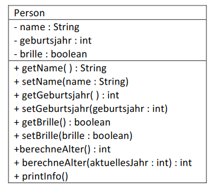

# Aufgabe 01
Dieses Beispiel zeigt die Definition einer Klasse ***Person*** mit den für uns relevanten **Eigenschaften (Attributen)**, sowie
Möglichkeiten um konkrete Werte abzufragen **(get-Methoden)** oder Werte zu ändern **(set-Methoden)**:

### **Eigenschaften (Attribute):**

- name ... ein Text (Datentyp String)
- geburtsjahr ... eine ganze Zahl (Datentyp int)
- brille ... true / false (Datentyp boolean)

### **UML-Diagramm:**

