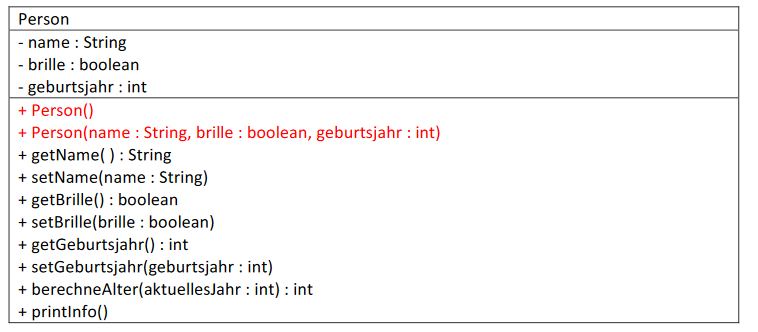

# Aufgabe 02
Die Klasse ***Person*** wird um einen parameterlosen Konstruktor (Standardkonstruktor) und einen Konstruktor mit
Übergabeparameter erweitert:

### UML-Diagramm:


### Erweiterungen zum Quelltext der Klasse Person: (Achtung: unvollständiger Quelltext)

```java
public class Person {
    
    private String name = "Stefan";
    private boolean brille = true;
    private int geburtsjahr = 2000; // Zuweisung bei der Definition nicht mehr erforderlich!
    
    public Person() {
        setName("Max");
        // ...
    }
    public Person(String name, boolean brille, int geburtsjahr) {
        setName(name);
        // ...
    }
    // ...                       // bereits bekannte Methoden sind nicht mehr aufgelistet!
}
```
### Wer damit fertig ist, überlegt sich eine
- eigene Klasse dmit 5 Attributen,
- erstellt alle get- und set-Methoden,
- einen parameterlosen Konstruktor,
- einen Konstruktor mit allen möglichen Übergabeparametern und
- eine printInfo()-Methode zur Ausgabe aller Eigenschaften des Objektes auf die Konsole.

### Biite beachten:
- Ein Konstruktor muss genauso wie die Klasse benannt sein und wird daher mit großem Anfangsbuchstaben
geschrieben. In unserem Beispiel also:
*public Person(...)
{
...
}*
- Im Gegensatz zu get- und set-Methoden gibt es keinen Rückgabedatentyp
(d.h. kein *int, void,* ... nach *public*)
- Er wird aufgerufen, wenn Ihr in BlueJ mittels *new Person(...)* ein neues Objekt erzeugt.
- Er kann Übergabeparameter haben. Ein Konstruktor ohne Übergabeparameter wird Standardkonsturktor
oder auch Default-Konstruktor genannt.
- Der Konstruktor erzeugt das Objekt und wird auch dazu verwendet, um den Eigenschaften eines Objektes
passende Anfangswerte zuzuweisen.

### Namenskonventionen in Java:

Hierbei handelt es sich um Richtlinien, die von Java-Programmierern eingehalten werden, um die Lesbarkeit eines
Quelltextes zu verbessern.

- Sprechende Klassen-, Attribut/Variablen- und Methodennamen verwenden.
z.B.: *Person* nicht *Klasse1*
- Klassennamen beginnen immer mit einem Großbuchstaben
- Variablen- und Methodennamen beginnen immer mit einem Kleinbuchstaben
zB: *geburtsjahr* oder *berechneAlter(...)*
- Bei zusammengesetzten Worten wird der jeweils erste Buchstabe groß geschrieben (allererster Buchstabe
bei Variablen/Attributen & Methoden natürlich ausgenommen)
z.B.: *setName(...)* oder *printInfo()*
- Keine Umlaute und Sonderzeichen verwenden – das kann zu Problemen führen.
also: statt *größe* bzw. *getGröße(...)* unbedingt *groesse* bzw. *getGroesse(...)* schreiben
