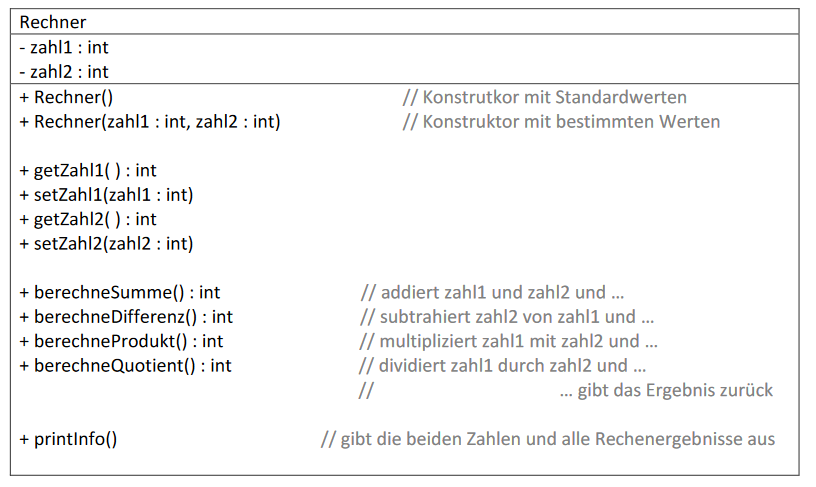
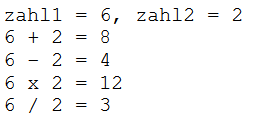

# Aufgabe 03

### Teil a) Klasse Flugzeug: 
Überlege Dir mindestens 5 für ein Flugzeug typische Eigeneschaften (z.B.: Name der Fluglinie, Hersteller, Typ, Sitzplätze für Passagiere, fliegt gerade,...)

- Bei den **Datentypen** der Attribute müssen **Texte**, **Zahlen** und **Wahrheitswerte**
vorkommen.
- Für jedes Attribut gibt es eine **get-** und **set**-Methode.
(Wer es schon verstanden hat, verwendet bitte für die Namen der Übergabe-
parameter die gleichen Namen wie für die Attribute **→** und damit **this**)
- Es soll zumindest **zwei Konstruktoren** geben (einer davon soll nur für einen Teil der
Attribute Übergabeparameter vorsehen, die anderen Attribute erhalten fixe Werte).
Die Konstruktoren **verwenden die set-Methoden**.
- Es gibt eine Methode welche eine **Berechnung** durchführt
(z.B.: Schätzung des Gesamtgewichtes aus Eigengewicht und Anzahl der Passagiere *
80 kg, maximale Flugzeit die aus Tankinhalt und Verbrauch berechnet wird,...)
- Überlege Dir weitere Methoden, mit denen das Verhalten eines Flugzeuges simuliert
werden kann, wie z.B. starten, landen, boarding (einsteigen), alle aussteigen,...
- Es gibt eine **printInfo()**-Methode welche die Werte aller Attribute und alle
berechneten Werte auf die Konsole ausgibt.

### Teil b) Klasse Rechner: 
Implementiere die im nachfolgenden UML-Diagramm beschriebene Klasse und teste sie gründlich:

#### Hinweise:
- *printInfo()* soll die beiden Zahlen und alle Rechenergebnisse auf die Konsole
ausgeben. Beispiel der Ausgabe für die Zahlen 6 und 2:

- Teste alle berechne Methoden auch mit folgenden Werte:
zahl1 = 0, zahl2 = 0 ... Was beobachtest Du?
zahl1 = 2, zahl2 = 3 ... Was fällt Dir bei den Ergebnissen auf?
- Statt des Datentypes **int** verwenden wir **double** (oder **float**).
Was ändert sich am Verhalten der Methoden?
