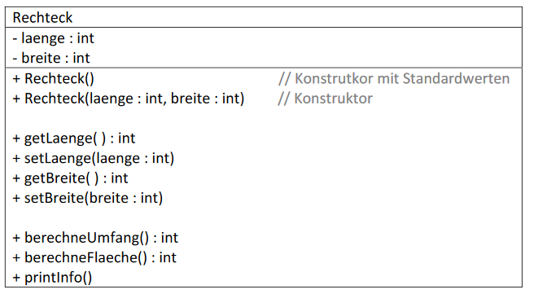
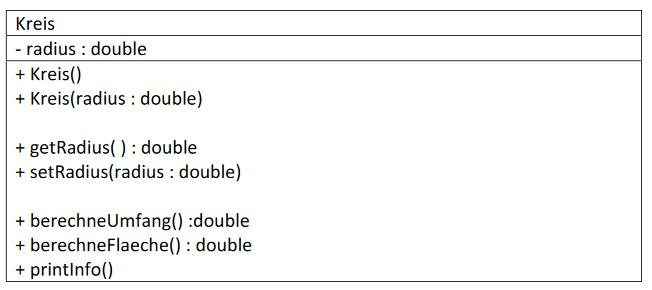
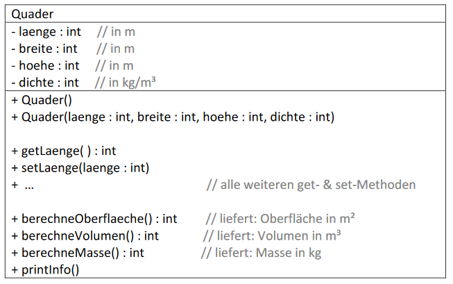

# Aufgabe 04
Zu schreiben sind folgende Klassen:
### a) Klasse Rechteck (UML-Diagramm):

Hinweise:
- Der Konstruktor soll die set-Methoden verwenden
- *printInfo()* soll alle Informationen des Rechtecks auf die Konsole ausgeben.

Beispiel: Rechteck:
> Breite = 2m 

> Länge = 5m

> Umfang = 14m

> Fläche = 10m²

Für die Werte von Umfang und Flächenhinhalt sind die vorhandenen Methoden zu
verwenden – d.h. **keine Formel in der printInfo()-Methode!**

### b) Klasse Kreis:

Hinweise:
- einen Überblick der einfachen Datentypen von Java findet Ihr auf:
http://de.wikibooks.org/wiki/Java_Standard:_Primitive_Datentypen
oder
http://openbook.galileocomputing.de/javainsel9/javainsel_02_003.htm
(Kapitel 2.3.1 ... Primitive Datentypen im Überblick)
- Zur Berechnug von Kreisumfang und Kreisfläche benötigt man π.
Dafür einfach ein Attribut pi mit dem double-Wert 3.14159265 definieren.
- Bitte auch hier **keine Formeln in der printInfo()-Methode!**

### c) Klasse Quader:

Hinweise:
- Die Formeln für die Oberfläche und das Volumen eines Quaders sollten bekannt sein!
- Masse = Dichte * Volumen
- Versuche abschließend die Masse eines Quarders auszurechenen und prüfe das
Ergebnis auf Plausibilität (d.h. handelt es sich um ein sinnvolles Ergebnis).
Typische Werte für die Dichte einiger Materialien:
> Wasser: 1000 kg / m³ 

> Metall: 7860 kg / m³

> Holz: 400 bis 800 kg/m³ 

> Beton: 1800 bis 2450 kg / m³

### d) Weitere Klassen:
Wer früher fertig ist, kann sich überlegen wie Klassen für andere geometrische Figuren
(Zylinder, Kugel, ...) mit entsprechenden Berechnungen realisierbar sind.
