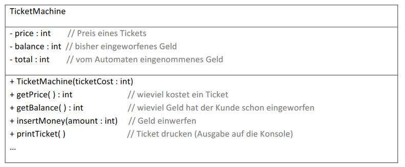

# Aufgabe 06 – einfacher Ticketautomat
UML-Diagramm:

Dieser einfache Automat enthält noch einige Fehler. Teste den Automaten und notiere alle
erkannten Fehler:
- Aufruf von *getPrice()*, um den Preis einer Fahrkarte zu ermitteln
- Aufruf von *getBalance()*, um festzustellen wieviel Geld schon eingeworfen wurde
- Aufruf von *insertMoney()*, um Geld einzuwerfen
- nochmal *getBalance()* aufrufen
- Aufruf von printTicket(), um eine Fahrkarte zu drucken (was passiert mit *balance* und *total*)
- ...

Beachte auch die Möglichkeit negativer Übergabewerte!

Verbessere den Automaten und erweitere ihn um die Methode ***refundBalance():int**, welche das noch
übrige eingeworfene Geld wieder zurückgibt und dabei ***balance*** auf 0 setzt und
eine Methode ***empty(): int***, die das gesamte vom Automaten eingenommene Geld als Rückgabewert
liefert und das Attribut ***total*** wieder auf 0 setzt.

## Eine Extraaufgabe für jene, die früher fertig sind:
Erweitere den Automat um die Attribute ***child*** und ***bike***. Beide sollen vom Typ boolean sein.
Es sind keine weiteren Attribute erforderlich (Tipp: lokale Variablen, Hilfsmethoden).

Es soll eine Methode ***setChild(...)*** geben, mit der statt eines normalen Tickets auf eine
Kinderfahrkarte zum halben Preis umgestellt werden kann.

Es soll eine Methode ***setBike(...)*** geben mit der das Ticket für die zusätzliche Mitnahme eines
Fahrrades gekauft werden kann. Dieses Ticket kostet das Doppelte eines normalen Tickets.

Wichtig: **Das Attribut price soll immer den vollen Ticketpreis enthalten!**
D.h. es sind die Methoden getPrice() und printTicket() entsprechend anzupassen
