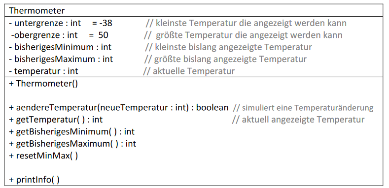
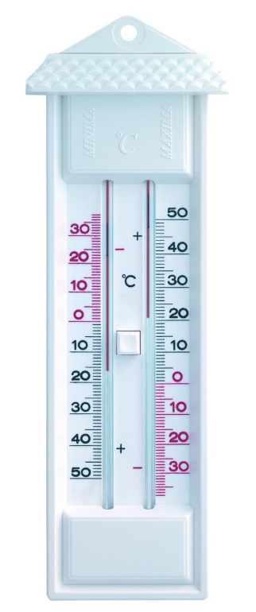

# Aufgabe 07 - if-Anweisung, Maximum, Minimum

Zu erstellen ist folgende Klasse:

**Erklärungen:**
- Der **Konstruktor** ist parameterlos und belegt die Attribute mit geeigneten Anfangswerten:
Zunächst untergrenze mit -38 und obergrenze mit 50. Überlege Dir auch geeignete
Anfangswerte für bisherigesMinimum, bisherigesMaximum und temperatur !

Die Unter- und Obergrenze des Thermometers wird später nicht mehr geändert, d.h. für
diese Attribute sind keine öffentlichen set-Methoden erforderlich.

- ***aendereTemperatur(...)*** ... ändert die aktuelle Temperatur temperatur, aktualisiert die
Attribute bisherigesMinimum und bisherigesMaximum und *gibt auf die Konsole aus*, ob die
Temperatur im Vergleich zum vorhergehenden Wert gestiegen oder gefallen ist.

Achtung: die aktuelle Temperatur soll nur geändert werden, wenn der übergebene Wert
innerhalb der erlaubten Grenzen liegt. Je nach Erfolg ist true (Änderung ok) oder
false (der neue Wert liegt außerhalb der erlaubten Grenzen) zurückzugeben!

- ***printInfo()*** gibt die Attribute auf die Konsole in folgender Form aus:

  *aktuelle Temperatur: 8° Celsius*

  *bisheriges Minimum: -10° Celsius*

  *bisheriges Maximum: 9° Celsius*

  Wenn die aktuelle Temperatur kleiner als 4 Grad ist, soll zusätzlich ausgegeben werden:

  *Achtung Glatteisgefahr!*

- ***resetMinMax()*** „löscht“ die Minimum- und Maximumwerte des Thermometers. Überlege
Dir, was Löschen in diesem Fall bedeutet. Eine Zuweisung von 0 wird meist falsch sein!

#### Zum besseren Verständnis:

#### Produktinformationen Maxima-Minima-Thermometer
... Die beiden Skalen zeigen die jeweiligen Höchst- und
Tiefstwerte an, die seit der letzten Rückstellung ermittelt
wurden. Rückstellung über gut erreichbare Drucktaste.
Messbereich -38 °C bis +50 °C.

