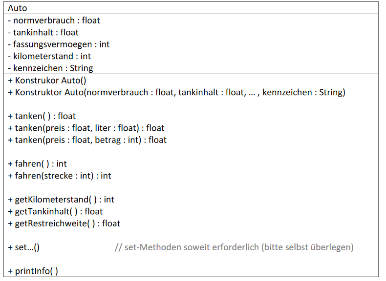

### Aufgabe 08 – if, gleichnamige Methoden (Signatur), typecast

Zu erstellen ist folgenden Klasse:

### Dokumentation:

#### Die Klasse sowie alle Konstruktoren und Methoden sind javadoc-tauglich zu kommentieren!

### Attribute:

- **normverbrauch** .... Verbrauch in Liter pro 100 km, z.B.: 4,9 [l / 100km]
- **tankinhalt** ... aktueller Tankinhalt, kann natürlich niemals kleiner als 0 oder größer als das Fassungsvermögen sein.
- **fassungsvermoegen** ... maximaler Tankinhalt (in Litern), soll bei der Instanziierung (dem Erzeugen eines Objektes) einmalig gesetzt und später nicht mehr verändert werden können.
- **kilometerstand** ... aktueller Kilometerstand des Autos (kann nur erhöht werden)
- **kennzeichen** ... eine **Referenz auf ein String-Objekt** mit mindestens 6 Zeichen oder eine **Nullreferenz**, wenn das Fahrzeug nicht angemeldet ist

Tipp: Sieh Dir in der Java-API-Documantation die Methoden der String-Klasse an
*length()*, *empty()*, *indexOf(String str)*, ev. *contains(...)*

### Methoden und Konstruktoren:

Übergabewerte sollen überprüft werden (Konstruktoren **→** set-Methoden). Falls notwendig
sind Fehlermeldung auszugeben und sinnvolle Default-Werte zu verwenden.

Konstrukor ***Auto()***
Parameterloser Standardkonstruktor. Da keine Werte für die Instanzvariablen zur Verfügung
stehen, sind sinnvolle Anfangswerte zu wählen.
zB:
> normverbrauch = 4.9

> tankinhalt = 33.5

> fassungsvermoegen = 50

> kilometerstand = 40000

> kennzeichen = null

Konstruktor **Auto(normverbrauch : float, tankinhalt : float, ... , kennzeichen : String)**

Setzt die Instanzvariablen auf die angegebenen Werte.

**Achtung:** dabei sind natürlich Überprüfungen / Korrekturen durchzuführen
(diese sollten an entsprechenden set-Methoden delegiert werden).

**tanken( ) : float**

Füllt den Tank randvoll und gibt die getankte Treibstoffmenge zurück.

**tanken(preis : float, liter : float) : float**

Füllt die angegebene Treibstoffmenge in den Tank (zum angegebenen Literpreis) und gibt
den zu bezahlenden Gesamtbetrag zurück.
**Achtung:** Fassungsvermögen des Tanks berücksichtigen!

**tanken(preis : float, betrag : int) : float**

Tankt für einen bestimmten, angegebenen Geldbetrag (z.B.: 20 Euro). D.h. hier ist die dafür
erhältlich Treibstoffmenge zu berechnen und natürlich auch wieder das maximale
Fassungsvermögen zu berücksichtigen.
Rückgabewert ist die tatsächlich getankte Treibstoffmenge in Litern.

**Zusatzfrage: Was passiert, wenn der Typ des Betrages von int auf float geändert wird? Warum?**

