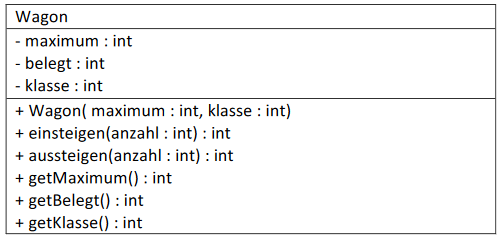
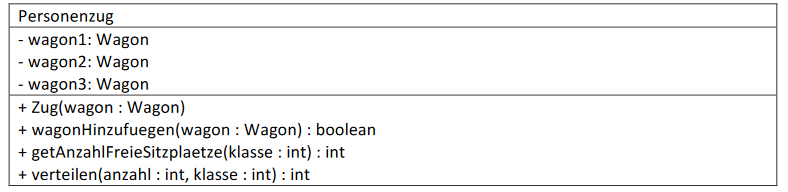

# Aufgabe 10) Zu erstellen sind zwei Klassen mit folgenden Eigenschaften & Methoden

### Klasse Wagon:

### Vorgaben:
*maximum:* maximale Anzahl von Sitzplätzen dieses Wagons (es gilt: 100 <= maximum <= 200)
belegt: Anzahl von aktuell belegten Sitzplätzen (es gilt: 0 <= belegt <= maximum)

*klasse:* kann nur die Werte 1 oder 2 annehmen (entspricht der 1. oder 2. Klasse)

#### Konstruktor Wagon(...):
Erzeugt einen Wagon, wobei belegt = 0 ist und maximum nur auf einen Wert zwischen 100 und 200
gesetzt wird. Bei einem ungültigen Wert für maximum soll 100 als Default-Wert verwendet werden.
Klasse darf nur 1 oder 2 sein, Default-Wert hier: 2

#### einsteigen(...):
Lässt eine bestimmte Anzahl von Personen einsteigen (Parameter: anzahl).
**Rückgabewert** der Methode ist die Anzahl von Personen die NICHT Platz gefunden haben.
Finden alle Personen Platz, oder wurde eine ungültige (negative) Anzahl von Personen angegeben
dann ist der Rückgabewert der Methode 0.

*Bsp.:* *maximum* = 150, *belegt* = 100 und es sollen 60 Personen einsteigen.
Da nur 50 Personen Platz finden, ist der Rückgabewert in diesem Fall 10.

#### aussteigen(...):
Lässt eine bestimmte Anzahl von Personen aussteigen. Das Attribut belegt soll natürlich nur
verändert werden, wenn ein positiver Wert übergeben wurde und es ist sicherzustellen, dass belegt
niemals negativ wird (z.B.: weil mehr Personen aussteigen sollen, als vorhanden sind!)
**Rückgabewert** ist die Anzahl der tatsächlich aussteigenden Personen.

*Bsp.:* *maximum* = 150, *belegt* = 30 und es sollen 40 Personen aussteigen.
Da nur 30 Personen vorhanden sind, ist der Rückgabewert in diesem Fall 30.

Die *get-Methoden* bedürfen keiner weiteren Erklärung, *set-Methoden* gibt es keine, da die maximale
Anzahl von Sitzplätzen nachträglich nicht veränderbar sein soll und belegt mittels *einsteigen(...)* und
*ausssteigen(...)* verändert wird.

### Klasse Zug:

### Vorgaben:

*wagon1* bis *wagon3*: unser Zug kann aus bis zu 3 Wagons bestehen, die über diese Referenzvariablen
angesprochen werden. Eine Lokomotive wird hier nicht eigens behandelt.

#### Konstruktor Zug(...):
Es kann ein gültiges Objekt vom Typ Wagon übergeben werden, das dann als erster Wagon
hinzugefügt wird. Sollte eine Nullreferenz (*null*) übergeben werden, dann ist ein „Default-Wagon“ zu
erzeugen ( ... *new Wagon(...)* )und einzufügen, der folgende Eigenschaften hat:

maximale Anzahl der Sitzplätze: 100, keine Plätze belegt, 2. Klasse.

#### wagonHinzufuegen(...):
Der als Parameter übergebene Wagon wird hinzugefügt, sofern noch ein Attribut dafür frei ist.
**Rückgabewert:** true bei erfolgreichem Hinzufügen, andernfalls false (bei Übergabe von *null*)

#### getAnzahlFreieSitzplaetze(...):
**Rückgabewert:** 
> wenn Parameter klasse = 0 ... die Anzahl aller freien Sitzplätze in allen Wagons

> wenn Parameter klasse = 1 ... die Anzahl aller freien Sitzplätze in 1. Klasse Wagons

> wenn Parameter klasse = 2 ... die Anzahl aller freien Sitzplätze in 2. Klasse Wagons

#### verteilen(...):
Diese Methode geht Wagon für Wagon durch (beginnend beim Ersten) und befüllt sozusagen die
Sitzplätze. Wenn nicht alle Personen im 1. Wagon Platz finden, dann geht es weiter zum 2., ...
Wenn nicht alle Personen einen Platz gefunden haben, dann fahren sie nicht mit. D.h. der
**Rückgabewert** liefert die Anzahl der Personen, die NICHT Platz hatten.

***Achtung:*** es gibt Wagons 1. und 2. Klasse. Die Personen dürfen nur jenen Wagons zugeteilt werden,
deren Klasse mit der hier Übergebenen (Parameter *klasse*) übereinstimmt!

### Testklasse:

- Erstelle eine Testklasse in der ein Zug mit mindestens 2 Wagons erstellt wird
- Gib aus wie viele Plätze in den Wagons der Klasse 2 und in allen Wagon verfügbar sind
- „Verteile“ eine Anzahl von Personen in Wagons mit einer bestimmten Klasse und gib
danach die Belegung der Wagons aus.
