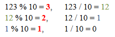

# Aufgabe 11 – erste Schleifenbeispiele

Zu erstellen ist eine Klasse Schleife

### Eigenschaft:
- *limit* ... Zahl, Wertebereich: -20 bis +20 **→** d.h. prüfen des Parameters! Default-Wert: 10

### Konstruktoren:
- *Schleife()*
- *Schleife(limit : int)*

### Methoden:
- *getLimit()* Gibt den Wert der Eigenschaft limit zurück.

  *setLimit(limit : int)* Setzt einen neuen Wert für limit (Wertebereich beachten).
- *schleife1()* Gibt die Zahlen von 0 bis zu limit aus.

  Achtung: *limit* kann auch negativ sein → die Ausgabe ist dann: 0 -1 -2...
- schleife2(start : int) Gibt von start bis zu *limit* aus.

  *start* kleiner *limit:* Schrittweite +1
 
  *start* größer *limit:* Schrittweite -1

- *schleife3(p1: int, p2: int)* Zählt **vom kleineren** Parameter **bis zum größeren** Parameter.

- *schleife4( start : int)* Gibt die **geraden Zahlen** von *start* bis zu *limit* aus.

  **Achtung** *start* kann auch ungerade sein!

- *schleife5( zeichen : String, anzahl : int)* Gibt das angegebene Zeichen anzahl mal ohne Zeilenumbruch aus.

  Beispiel: *schleife5(“*“, 5);* Ausgabe: *****

- *a_hoch_n(a : int, n : int) : int* berechnet a^n, Rückgabewert ist das Ergebnis

  Erklärung: a^0 = 1 , a^1 = a, a^2 = a*a, a^3 = a*a*a, ...
  
  Erweiterung für negative Hochzahlen: a^-n = 1/a^n
  
- *folge(anzahl : int)*

  gibt folgende Werte in Form von Brüchen aus (z.B. für anzahl = 6):
  
  1/1, 3/2, -9/4, 27/7, 81/11, -243/16
  
  **Hinweise:** Man kann mehr als eine Laufvariable (z.B.: *i, z, n*) verwenden, das ausgegebene Vorzeichen ist bei
jedem dritten Bruch negativ (Modulo-Operator verwenden!), der Zähler (*z*) verdreifacht sich, der Nenner (*n*)
erhöht sich mit jedem Schleifendurchlauf um den Wert der Laufvariable (*i*) (...+1,...+2,...+3,...+4,...)
  
- *berechneQuersumme(zahl : int) : int*

  Bildet die Ziffernsumme einer ganzen Zahl.
  
  Beispiel: zahl = 123, Ziffernsumme: **1**+**2**+**3** = 6
  
**Tipp:**

**Realisiere zumindest eines der Schleifenbeispiele auch in der zweiten Schleifenvariante
(statt *while* eine *do-while* oder umgekehrt)**
  
