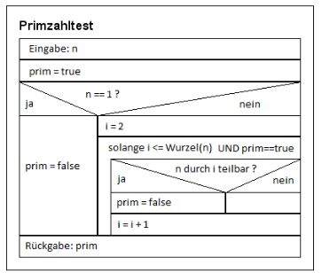
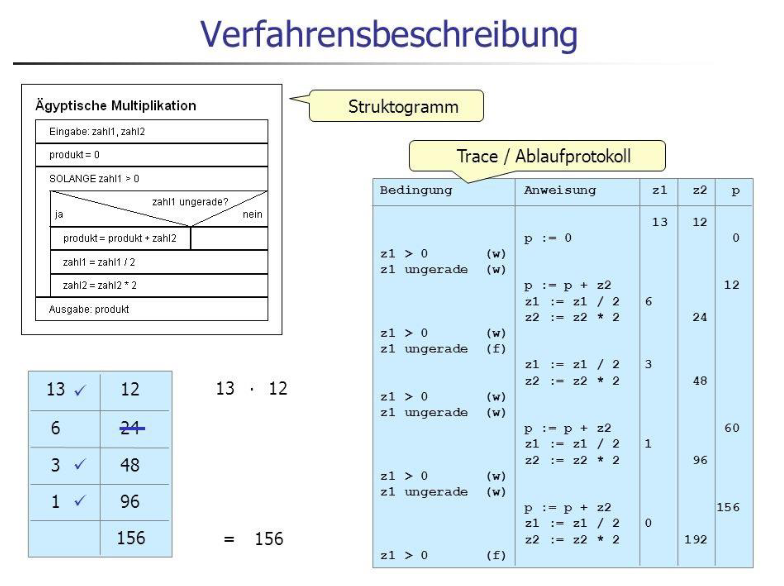

# Aufgabe 12 – weitere Schleifenbeispiele

Zu Erstellen ist eine Klasse **Schleifen2**. Diese Klasse definiert keine Attribute, benötigt keinen
speziellen Konstruktor und auch keine get- und set-Methoden! Es wird hier „nur“ die Verwendung
verschiedener Schleifen geübt. Wer bislang nur mit **while** oder **do-while** gearbeitet hat, soll hier auch
die **for**-Schleife verwenden.

- **folge1(anzahl : int) : float**

  berechnet die Summe der Brüche 1/1, 1/2 , 1/4, 1/8, 1/16,...
  
  zB: folge1(4) *gibt 1.875 zurück* (also 1 + 0.5 + 0.25 + 0.125)
  
- **folge2(anzahl : int)**   
  
  gibt folgende Werte in Form von Brüchen aus (z.B. für anzahl = 6):
  
  -2/10 +4/15 -8/25 +16/40 -32/65 +64/105
  
  **Hinweis:** Betrachte zur Berechnung des neuen Nenners die beiden vorangegangenen Brüche.
  
- **istPrimzahl(n : int) : boolean**

  Stellt fest ob *n* eine Primzahl ist. Wenn ja wird *true* zurückgegeben, sonst *false*.
  Eine Primzahl ist eine natürliche Zahl, die größer als 1 ist und die außer durch 1 und durch sich
  selbst durch keine weitere natürliche Zahl teilbar ist.

  **Hinweis:** Das **Struktogramm** zeigt die Vorgehensweise.
  
  Man versucht die gegebene Zahl n durch eine ständig
  größer werdende ganze Zahl (Divisor) zu dividieren.
  Der Divisor beginnt bei 2 und endet bei √n
  (*Math.sqrt(...)*).
  Ist dies restlos möglich, handelt es sich um **keine** Primzahl.
  
  (ebenfalls möglich: *return* *false* oder *break*)
  
  
  
- **berechnePrimzahlen(start : int, ende : int)**
  
  Diese Methode soll alle Primzahlen zwischen *start* und *ende* ausgeben. Dazu soll die vorherige
  Methode **istPrimzahl(zahl : int) : boolean** verwendet werden. Die Primzahlen sollen durch
  Beistrich getrennt ausgegeben werden und nach jeder 10. Zahl ist ein Zeilenumbruch zu machen.
   
  Hinweis: sollte *start* > *ende* sein, dann die beiden Werte vertauschen (**„Dreieckstausch“**) 
  
- **aegyptischeMultiplikation(zahl1 : int,zahl2 : int) : int**

  Die ägyptische Multiplikation ist ein einfaches Verfahren zur Multiplikation zweier natürlicher
  Zahlen (siehe auch: https://de.wikipedia.org/wiki/Russische_Bauernmultiplikation)   
  
  Die nachfolgende Abbildung zeigt die Vorgehensweise in Form eines Struktogramms und die
  beim Ablauf auftretenden Zwischenergebnisse als Ablaufprotokoll (entspricht dem in der Theorie
  kurz genannten „Schreibtischtest“).
  
  Realisiere eine Methode, welche dieses Verfahren verwendet und das Ergebnis zurückgibt.
  
  
  
- Schreib eine Methode **testeAegyptischeMultiplikation()**

  wo die Methode **aegyptischeMultiplikation(...)** mit unterschiedlichen (auch negativen) Zahlen
  aufgerufen wird und wo mittels if-Anweisung überprüft wird, ob das Ergebnis mit dem Produkt
  der beiden Zahlen übereinstimmt.
  
  Gib für zumindest 3 Testfälle aus:
  
  > beide Zahlen,
  
  > beide Ergebnisse (Ergebnis des Methodenaufrufs und direkte Berechnung mittels zahl1*zahl2)

  > zusätzlich, ob die jeweiligen Ergebnisse übereinstimmen („ok“) oder nicht („nicht ok“).
