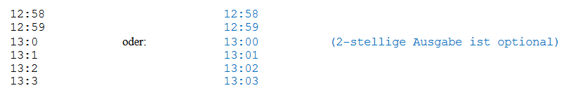
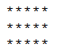
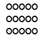
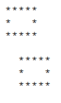
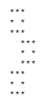
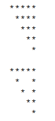
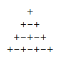
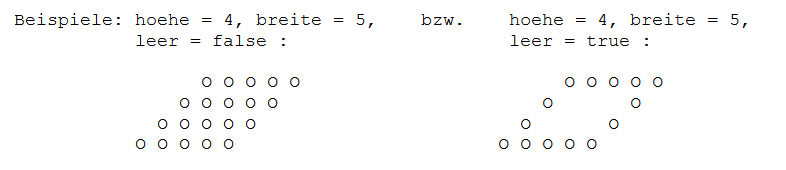
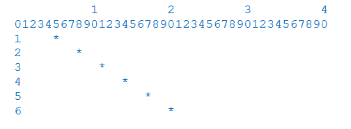

# Aufgabe 13 - einfache Schleifen, Struktogramme, geschachtelte Schleifen

Zu erstellen ist eine Klasse **Schleifen3** ohne Attribute, mit den nachfolgenden Methoden.

### Teil 1 - „einfache Schleifen“:

Versuche dir die **Vorgehensweise** zu überlegen bevor du die Methoden *ausgabeFolge(...)* und
simuliereUhr(...) codierst und schreibe das jeweils in Form eines **Struktogramms** auf, ähnlich den
Struktogrammen der Methoden *istPrimzhal(...)* und *aegyptischeMultiplikation(...)* in
Aufgabe 12.

- **ausgabeFolge(zahl:int)**

  Abhängig vom Parameterwert werden folgende Zahlenfolgen ausgegeben:
  
  *ausgabeFolge(**5**);* gibt folgendes auf dem Bildschirm aus:
  
  1***5***2**4**3**3**
  
  *ausgabeFolge(**8**);* gibt folgendes auf dem Bildschirm aus:
  
  1***8***2**7**3**6**4**5**
  
- **simuliereUhr(vonStunde:int, vonMinute:int, bisStunde:int, bisMinute:int)**

  Simuliert eine Uhr, indem zwei Variablen (*stunde* und *minute*) von den Startwerten **von**... bis zu
  den Endwerten **bis**... hochzählen. Liegt die Startzeit nach der Endzeit, dann sind die Werte vorher zu
  tauschen.
  
  Beispiel: *simuliereUhr(12, 58, 13, 3)* gibt aus:
  
  
  
### Teil 2 - „geschachtelte Schleifen“:

Der Parameter *hoehe* gibt immer die Höhe (= Anzahl auszugebender Zeilen) der zu zeichnenden Figur an.

- **zeichneRechteckVoll(hoehe:int, breite:int)**
  
  Beispiel: hoehe = 3, breite 5
  
  
  
- **zeichneRechteckVoll(hoehe:int, breite:int, zeichen:String)**
  
  Beispiel: hoehe = 3, breite = 5, zeichen = “O“
  
  

- **zeichneRechteckLeer(hoehe:int, breite:int, abstand:int)**

  Beispiel: hoehe = 3, breite = 5, abstand = 0
  
  Beispiel: hoehe = 3, breite = 5, abstand = 2
  
  (2 Leerzeichen links vom Rechteck ausgegeben)
  
  
  
- **zeichne3Quadrate(seite:int)**

  Beispiel: seite = 3
  
  Verwende zum Zeichnen 
  dieser Figur die Methode:
  *zeichneRechteckLeer(...)*

  

- **zeichneDreieck(hoehe:int, leer:boolean)**

  Beispiel: hoehe = 5, leer = false
  
  Beispiel: hoehe = 5, leer = true 
  
  

- **zeichneDreieckPlusMinus(hoehe:int)**

  Beispiel: hoehe = 4 
  
  

- **zeichneParallelogramm(hoehe:int, breite:int, leer:boolean)**

  

- **zeichneFunktion(anz :int)**

  Beispiel: anz = 6
  
  Dargestellt wir die Funktion: ***y = 3 \* x + 2***
  
  (**X**-Achse zeigt nach unten)
  
  

