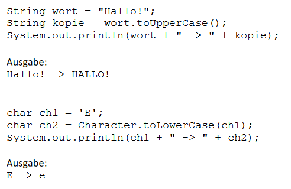

# Aufgabe 14) – Schleifen, switch-Anweisung, String-Methoden

Zur besseren Verständlichkeit beim Buchstabieren wird im Flugverkehr das internationale
Merkwortalphabet verwendet (eingeführt von der ICAO):

Erstelle eine Klasse mit einer Methode *buchstabieren(String wort)*, der ein Wort als
Zeichenkette übergeben wird, die dieses Wort Buchstabe für Buchstabe durchläuft (z.B.: while- oder
for-Schleife) und für jeden Buchstaben (Typ: *char*) das entsprechende Merkwort (Alpha, Bravo,...)
ausgibt (in diesem Beispiel mit Hilfe einer switch-Anweisung).

Das Programm soll sowohl für Klein- als auch für Großbuchstaben funktionieren. Für nicht erkannte
Zeichen (z.B.: Leerzeichen, Umlaute Ä, Ö, oder ß) soll ein Fragezeichen ausgeben werden.

**Beispiel:** Es wird das Wort „Häuser“ übergeben (*buchstabieren(“Häuser“)*),
die Ausgabe auf der Konsole soll folgendermaßen aussehen:

Die Groß- und Kleinschreibung bei der Ausgabe ist zu beachten. Die Buchstaben sollen in der
**originalen Schreibweise** ausgegeben werden!

### Tipps:

Um der Reihe nach auf einzelne Buchstaben zuzugreifen, können folgende Methoden der String-
Klasse verwendet werden (siehe auch JavaDoc):

***charAt(int index):*** 

gibt einen bestimmten Buchstaben eines Textes zurück
(Typ char, ob index bei 0 oder 1 beginnt **→** siehe JavaDoc)

***length()***
gibt die Anzahl der Buchstaben eines Textes zurück

Um ein Wort oder einzelne Buchstaben in Groß- bzw. Kleinbuchstaben umzuwandeln gibt es
folgende Möglichkeiten:

***toUpperCase()*** bzw. ***toLowerCase()***

gibt eine Kopie des Textes zurück, der nur aus
Groß- bzw. Kleinbuchstaben besteht.

***Character.toUpperCase(char ch)*** bzw. ***Character.toLowerCase(char ch)*** ... gibt
den übergebenen Buchstaben als Groß- bzw. Kleinbuchstabe zurück.

Diese statische Methode wird direkt mit Hilfe der Klasse *Character* aufgerufen und benötigt kein
Objekt – wie bereits die statischen Methoden der Math-Klasse: *Math.sqrt(...)*, *Math.max(...,...)*, ...

#### Beispiele:

