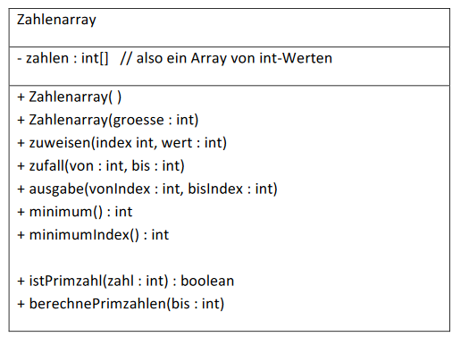

# Aufgabe 15) – Array / Schleifen

Erstelle eine Klasse *Zahlenarray*, welche als Attribut ein Array von int-Werten enthält.

#### Default-Konstruktor: Zahlenarray()

Erzeugt ein Array mit 10 int-Feldern und weist es dem Attribut *zahlen* zu.

**Hinweis:** Überprüfe mit Hilfe des Inspektor-Fensters und später der Methode *ausgabe(...)*, welche
Werte die Felder unmittelbar nach der Instanzierung enthalten!

#### Konstruktor: Zahlenarray(groesse : int)

Erzeugt ein Array mit groesse int-Feldern und weist es dem Attribut *zahlen* zu. Das Array soll mit
0-Werten initialisiert sein.

**Achtung:** der übergebene Wert von groesse muss überprüft werden!

#### zuweisen(index : int, wert : int)

Schreibt einen Wert in ein bestimmtes Feld des Arrays.

#### zufall(von : int, bis : int)

Füllt das Array mit Zufallszahlen (kleinster möglicher ***Wert:*** *von*, größter möglicher ***Wert:*** *bis*).

#### minimum() : int

Sucht den kleinsten Wert im Array (letztes Vorkommen) und gibt ihn zurück.

#### minimumIndex() : int

Sucht den kleinsten Wert im Array (letztes Vorkommen) und gibt den **Index** seines Feldes zurück.

#### ausgabe(vonIndex : int, bisIndex : int)

Enthält das Array z.B. die Werte [2, 4, -5, 8, -3, 1... , 7], dann soll die Ausgabe auf der Konsole nach
dem Aufruf ausgabe(0, 9) wie folgt aussehen:

> zahlen[0] = 2

> zahlen[1] = 4

> zahlen[2] = -5

> zahlen[3] = 8

...

> zahlen[9] = 7

bzw. ein Aufruf ausgabe(3, 5) liefert:

> zahlen[3] = 8

> zahlen[4] = -3

> zahlen[5] = 1

#### istPrimzahl(zahl :int) : boolean
Stellt fest ob zahl eine Primzahl ist. Wenn ja wird *true* zurückgegeben, sonst *false*.
(Diese Methode kann von einer früheren Übung übernommen werden)

#### berechnePrimzahlen(bis : int)
Durchläuft die ganzen Zahlen von 1 bis ***bis*** und überprüft mittels Aufruf der Methode *istPrimzahl(...)*,
ob es sich um eine Primzahl handelt oder nicht. Die dabei gefundenen Primzahlen werden in das
*zahlen*-Array geschrieben.

**Beispiel für bis=20:**
- Zuerst wird das Array intialisiert **→** [0, 0, ... 0]
- Dann werden die Primzahlen berechnet und eingetragen **→** [2, 3, 5, 7, 11, 13, 17, 19, 0, 0]
- Abschließend wird der Inhalt ausgegeben **→**

> zahlen[0] = 2

> zahlen[1] = 3

> zahlen[2] = 5

...

> zahlen[9] = 0

### Unbedingt testen was passiert wenn:
- beim Erzeugen des Arrays ohne Überprüfung ein Wert 0 oder ein negativer Wert für die
Array-Größe verwendet wird.
- mehr Primzahlen berechnet werden, als im Array Platz finden?
- für von oder bis in der Ausgabemethode oder den Index der zuweisen-Methode ein
ungültiger Index angegeben wird?
- ...

**Das Programm darf in keinem dieser Beispiele eine Exception werfen!**
