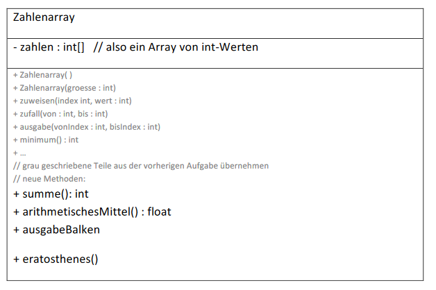
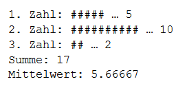
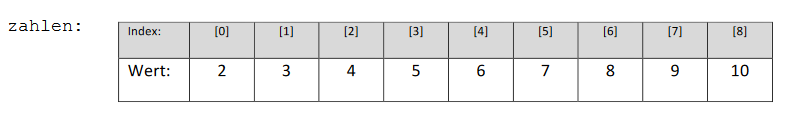
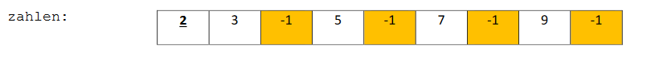
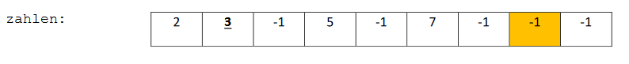

# Aufgabe 16) – Array / Schleifen

Erstelle für diese Aufgabe ein neues Projekt mit einer Kopie der Klasse *Zahlenarray* aus der
vorhergehenden Aufgabe und realisiere im neuen Projekt die Erweiterungen.

- **summe():int**

  Gibt die Summe aller Zahlen (Werte) des Arrays zurück.
  
- **arithmetischesMittel() :float**

  Berechnet sich aus der Summe aller Werte dividiert durch deren Anzahl (Größe des Arrays).
  Beachte, dass der Mittelwert in der Regel keine ganz Zahl sein wird!
  
- **ausgabeBalken()**

  Es werden alle Werte des Arrays in Form einer **Balkendarstellung** und zusätzlich auch deren **Summe**
  und **Mittelwert** (arithmetisches Mittel) auf die Konsole ausgegeben.

  **Beispiel:** Wird ein Array mit 3 Feldern z.B. mit zufällig generierten Zahlen befüllt (hier {5,10,2}), dann
  führt der Aufruf dieser Methode zu folgender Ausgabe:

**Tipp:** Zur Ausgabe der Balken kannst Du auch eine Hilfsmethode erstellen.

- **eratosthenes()**

Bestimmung aller Primzahlen von 2 bis n. Eine Beschreibung des Verfahren (*Sieb des Eratosthenes*) ist
auch auf Wikipedia zu finden: https://de.wikipedia.org/wiki/Sieb_des_Eratosthenes

Möchte man die Primzahlen von 1 bis n=10 bestimmen, wird zunächst ein Array mit 9 Feldern (n-1)
durch den Aufruf des Konstruktors *Zahlenarray(9)* erzeugt und durch diese Methode im **ersten
Schritt** mit aufsteigenden Zahlen beginnend bei 2 befüllt (1 ist keine Primzahl). Ergebnis:

**Zweiter Schritt:** Beginnend mit 2 (dem ersten Wert ungleich -1) werden **alle Vielfachen von 2
gestrichen** (in unserm Fall auf -1 gesetzt), bis das Ende des Arrays erreicht ist. Damit fallen alle
geraden Zahlen raus!

**Wichtig:** Das Array in 2-er Schritten durchlaufen und diese Werte (4, 6, 8, ...) auf -1 setzen.
***Nicht*** alle Felder durchlaufen und ***auf Teilbarkeit durch 2 prüfen***, das wäre sehr ineffizient!

**Dritter Schritt:** Alle Vielfachen der nächsten Zahl ungleich -1, in unserem Fall nun **3**, streichen:

**Weitere Schritte:** Die nächste Zahl ungleich -1 suchen (= 5) und alle Vielfachen davon streichen...
Diese Schritte werden solange wiederholt, bis keine weiteren Zahlen mehr zu verarbeiten sind.

**Letzter Schritt:** Die übrig gebliebenen Zahlen (ungleich -1) sind die Primzahlen zwischen 2 und n und
werden auf die Konsole ausgegeben

- **Erstelle eine Testklasse mit einer Methode test() in der:**

  > ein Zahlenarray-Objekt mit einer bestimmten Anzahl von Feldern erzeugt wird,
  
  > dieses Array mit Zufallswerten befüllt wird
  
  > und die ausgabeBalken()-Methode aufgerufen wird.
  
  > Teste abschließend die eratosthenes()-Methode an einem neuen Zahlenarray-Objekt.
