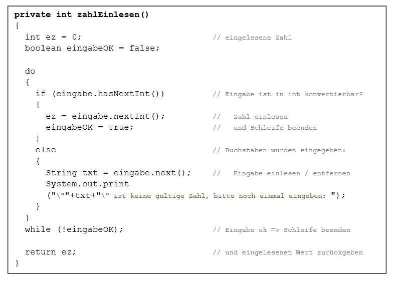

# Aufgabe 17) – Scanner

Erstelle für diese Aufgabe ein neues Projekt mit einer Kopie der Klasse *Zahlenarray* aus der
vorhergehenden Aufgabe und erweitere sie um eine Methode *menue()*:

Beim Aufruf der Methode soll eine Auswahl angezeigt werden, zB:

> **1 ... zuweisen(index, wert)**

> **2 ... zufall(von, bis)**

> **3 ... ausgabe(vonIndex, bisIndex)**

> **4 ... minimum()**

> **5 ... brechnePrimzahlen(bis)**

> **6 ... Programm beenden**

und es wird auf eine Benutzereingabe gewartet.

Wird nun zB: 1 eingegeben, so werden im nächsten Schritt Werte für die Übergabeparameter *index* und *werte* eingelesen und abschließend die Methode *zuweisen* mit diesen Werten aufgerufen.

Danach wartet das Programm wieder auf eine Eingabe einer Zahl zwischen 1 und 6.

...

Mit der Eingabe der Zahl 6 endet die Eingabeschleife und damit die Ausführung der *menue()*-
Methode.

### Hinweise:

- Die Methode *minimum()* liefert einen Rückgabewert. Wenn der Benutzer 4 wählt, dann soll
dieser Wert ausgegeben werden.
- Anstelle der Zahlen 1 bis 6 zur Auswahl der Methode oder des Programmendes, können auch
Buchstaben oder Worte verwendet werden, die eingelesen werden.
- Es kann sinnvoll sein für das korrekte Einlesen von Zahlen eine Hilfsmethode zu verwenden,
die dem Benutzer solange Eingaben machen lässt, bis eine gültige Zahl eingelesen wurde ...

Damit die Methode *zahlEinlesen()* funktioniert, muss in der umgebenden Klasse ein Attribut
**private Scanner eingabe = new Scanner(System.in);** existieren.

