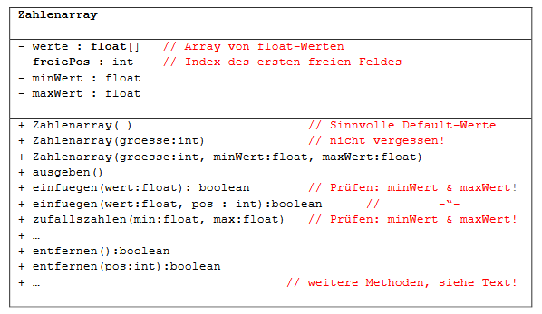

# Aufgabe 18) Array, „freiePos“, Sortieren

In dieser Aufgabe verwenden wir ein
Gleitkommazahlenarray und das im
Unterricht besprochene zusätzliche
Attribut ***freiePos***
(als Index des ersten freien Feldes)

**Weitere Attribute:** Für die erlaubten
Werte im Zahlenarray werden Grenzen
vorgegeben:
eine **Untergrenze minWert** mit einem
Default-Wert von -100.0 und
eine **Obergrenze maxWert** mit einem
Default-Wert von 500.0

### UML-Diagramm:

### Konstruktor: Zahlenarray(groesse:int, minWert:float, maxWert:float),
Neben *groesse* werden auch die zusätzlichen Attribute auf geeignete Werte gesetzt.
Dabei soll gelten: *minWert >= -100.0*, *maxWert <= 500.0*, *minWert<=maxWert*

**Tipp:** Einige Methoden lassen sich mit Hilfe anderer, zuvor geschriebener Methoden relativ einfach realisieren →
Verwende Methodenaufrufe wo dies sinnvoll erscheint!

- **ausgeben()**

  Gibt die befüllten Felder oder den Text *„Array ist leer“* aus.
  
- **einfuegen(...)**

  die *einfuegen(...)*-Methoden sollen zusätzlich im **Erfolgsfall** *true* und im **Fehlerfall** *false* zurückgeben.
  
- **zufallszahlen(...)**

  Befüllt das Array mit Zufallszahlen im gewünschten Wertebereich *min ... max*.
  **Achtung:** Was soll geschehen, wenn *min<minWert* oder *max>maxWert* ist?
  
-  **einlesen()**

  Werte von der Konsole einlesen und mittels *einfuegen*-Methode ins Array schreiben
  (zu verwenden ist die Klasse *java.util.Scanner*, Ende bei Eingabe von: -999 oder sobald das Array voll ist) 
  
- **einlesen(anzahl:int)**

  Wie die vorherige Methode, nur werden *anzahl* Werte von der Konsole eingelesen und ins Array geschrieben.
  
- **entfernen():boolean**
 
  Entfernt den **letzten Wert** aus dem Array
  (neu ist hier der Rückgabewert: erfolgreich **→** true, sonst **→** false).
  
- **entfernen(pos:int):boolean**

  Entfernt **den Wert an der Stelle pos** aus dem Array
  (neu ist hier der Rückgabewert: erfolgreich **→** true, sonst .**-→** false).
  
- **suchenPosition(wert:float):int**

  Gibt die **Position** des **letzten** Auftretens dieses Wertes im Array zurück. Bei Nichtfinden wird **-1** zurückgegeben.
  
- **entfernenLetzesVorkommen(wert:float):boolean**

  Entfernt den Wert aus dem Array. Bei mehreren gleichen Werten wird das **letzte** Vorkommen des Wertes entfernt!
  
- **entfernenAlleVorkommen(wert:float):boolean**

  Entfernt **alle** Elemente mit diesem Wert aus dem Array.
  
- **anzahl():int**

  Gibt die Anzahl der mit Werten befüllten Felder des Arrayy zurück (kann ungleich der Arraygröße sein!).
  
- **anzahlGroesser(wert:float):int**

  Gibt Anzahl der Elemente zurück, deren Wert größer-gleich dem angegebenen Parameter wert ist.
  
- **arrayGroesser(wert:float):float[]**

  Gibt ein Array mit genau jenen Werten zurück, deren Wert größer-gleich dem angegebenen Parameter *wert* ist.
  
- **tauschen(pos1:int, pos2:int)**

  Tauscht die an den Stellen *pos1* und *pos2* befindlichen Werte (Indizes und Belegung überprüfen!).
  
- **arraySortiert():float[]**

  Gibt ein neues Array zurück das alle Elemente von *werte* aufsteigend sortiert enthält (also nur die belegten
  Felder). Nur das zurückgegebene Array soll sortiert sein, das orignale Array *werte* bleibt unverändert!
  
  ***Sortieralogrithmus:***
  Verwende den in der Theorie optimierten Bubble-Sort oder einen anderen Sortieralgorithmus, den du selbst  
  implementierst (z.B.: Insertionsort: https://de.wikipedia.org/wiki/Insertionsort)
