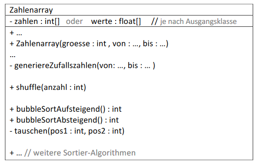

# Aufgabe 19

### Teil 1) Klasse Zahlenarray:

Die Klasse **Zahlenarray** kann zum Teil aus
Aufgabe 15 oder 18 übernommen und soll um einen
Konstruktor und einige Methoden ergänzt werden.

### UML-Diagramm:

#### Konstruktor:
Erzeugt ein Array in der angegebenen Größe
und initialisiert es mit Zufallszahlen im
vorgegebenen Bereich.

#### generiereZufallszahlen(von: ..., bis: ...)
befüllt das Array mit zufällig generierten Werten
im vorgegebenen Bereich.

#### shuffle(anzahl : int):
Mischt die (sortierten) Zahlen. Wie stark die Zahlen vermischt werden bestimmt anzahl. Mischen bedeutet anzahl
Vertauschungen der Werte von jeweils zwei zufällig gewählten Feldern des Arrays.

#### bubbleSortAufsteigend() : int
sortiert die Werte aufsteigend mittels des besprochenen BubbleSort-Algorithmus und zählt die für das Sortieren
durchgeführten **Zahlenvergleiche (= Rückgabewert)**.
- Was ist zu ändern, damit die Zahlen absteigend sortiert werden?

#### bubbleSortAbsteigend() : int
sortiert die Werte absteigend mittels BubbleSort-Algorithmus und zählt wiederum die für das Sortieren
durchgeführten **Zahlenvergleiche (= Rückgabewert)**...
