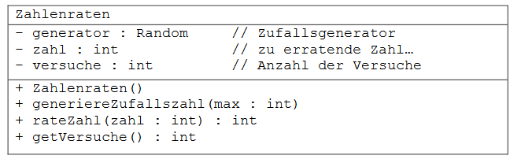
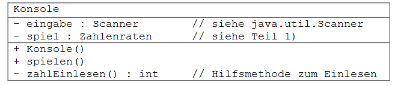
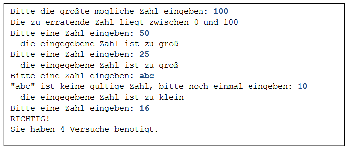
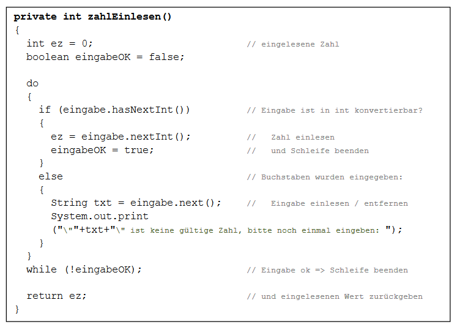

# Aufgabe 20) Zahlenraten (Schleifen, Scanner- & Random-Klasse, Assoziationen)

### Teil 1)
Die Klasse *Zahlenraten* stellt Methoden für ein einfaches Ratespiel zur Verfügung:

#### Vorgaben:
- Der Konstruktor erzeugt ein Random-Objekt und weist es der Referenz generator zu.
  Anweisung: *generator = new Random();*
  ***Beachte:*** Random befindet sich im Package *java.util*
- *generiereZufallszahl(max:int)* erzeugt eine zufällige ganze Zahl im Bereich von 0
  bis max, weist sie dem Attribut zahl zu und setzt den Versuchezähler wieder auf 0.
  ( siehe auch: *nextInt(...)*-Methode von *Random* )
- *rateZahl(zahl:int):int* wird zum Raten verwendet.
  Bei jedem Aufruf erhöht sich die Anzahl der Versuche.
  ***Rückgabewert:*** 
  > **-1** ... die übergebene Zahl war kleiner als die zu erratende Zahl,

  > **1** ... die übergebene Zahl war größer,

  > **0** ... die Zahl wurde erraten
- *getVersuche()* liefert die Anzahl wie oft geraten wurde

#### Ablauf:
Durch den Aufruf der Methode **generiereZufallszahl(...)** wird eine neue Zufallszahl
generiert und die Anzahl der Versuche auf 0 gesetzt ( Spielbeginn). Mittels wiederholten Aufruf der
Methode **rateZahl(...)**, kann man nun versuchen die Zahl zu erraten. Die Anzahl der benötigten
Versuche kann abschließend mit der Methode **getVersuche()** abgefragt werden.

### Teil 2)
Eine zusätzliche Klasse *Konsole* soll es ermöglichen das Zahlenratespiel mittels Ein- und Ausgaben
im Terminal-Fenster von BlueJ zu bedienen. Zum Einlesen der Benutzereingabe ist die Scanner-
Klasse zu verwenden, Ausgaben erfolgen mittels *System.out.print(...)* bzw. *println(...)*.

#### Vorgaben:
- Der Konstruktor erzeugt ein *Scanner*-Objekt zum Einlesen von der Konsole und ein
  *Zahlenraten*-Objekt - das eigentliche Spiel.
- Die Hilfsmethode *zahlEinlesen()* erlaubt das Einlesen von ganzzahligen Werten und
verhindert einen Programmabsturz aufgrund einer Exception bei einer ungültige Eingabe
(also z.B. bei Buchstaben). Die Methode fordert den Benutzer solange auf eine Zahl
einzugeben, bis eine gültige Eingabe erfolgt ist (Realisierung siehe Anmerkungen – Seite 3).
- *spielen()*
  > Startet das Spiel mit der Frage nach der Obergrenze für die zu erratende Zahl.
  
  > Bewirkt das Erzeugen einer entsprechende Zufallszahl.
  
  > Fordert solange wiederholt zur Zahleneingabe auf, bis die Zufallszahl erraten wird.
    Dabei wird immer ausgegeben, ob die eingegebene Zahl zu groß oder zu klein war.
  
  > Endet mit der Ausgabe der Anzahl der Versuche, sobald die Zufallszahl erraten wurde
    **Die Unterpunkte a) bis d) verwenden die Methoden des Zahlenraten-Objekts spiel!**
    
#### Hinweise:
- **Ablauf des Spiels:** Man erstellt ein *Konsole*-Objekt und ruft die Methode *spielen()* auf.
  Der Dialog im Terminal-Fenster könnte folgendermaßen aussehen:    
    

***Benutzereingaben sind hier zum besseren Verständnis blau dargestellt.***

- Eine Beschreibung der neuen Klassen **Random** und **Scanner** sowie ihrer Methoden findet
  sich in der **JAVA-API-Dokumentation**.
  
- Die Hilfsmethode zum Einlesen der Zahlen kann so realisiert werden:

### Optionale Erweiterungen:
- Anstelle des Random-Objektes könnte auch die Anweisung **Math.random()** verwendet
  werden. Diese liefert einen *double* Wert >= 0.0 und < 1.0. Überlege Dir, wie man aus
  diesem Wert eine ganze Zahle im gewünschten Bereich erzeugen kann.
- Erweitere die Konsolensteuerung so, dass am Ende des Spiels gefragt wird, ob man noch
  einmal spielen möchte und – abhängig von einer Benutzereingabe - ein neuer Durchgang
  gestartet oder das Spiel beendet wird.
- Erweitere das Spiel um die Möglichkeit auch den unteren Bereich der zu erratenden Zahl
  einzugeben. 
  
  D.h. statt [0, max] kann ein [min, max]-Bereich angegeben werden.
