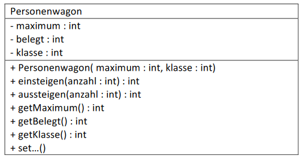
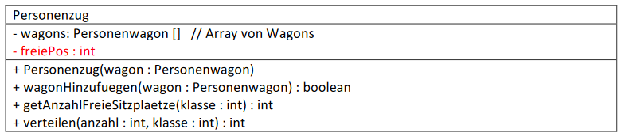

# Aufgabe 21) - Array & Assoziationen

Zu erstellen sind zwei Klassen:

**Klasse Personenwagon:** (kann aus Aufgabe 10 übernommen werden)

#### Vorgaben:

*maximum:* maximale Anzahl von Sitzplätzen dieses Wagons (es gilt: 100 <= maximum <= 200)
belegt: Anzahl von aktuell belegten Sitzplätzen (es gilt: 0 <= belegt <= maximum)
*klasse:* kann nur die Werte 1 oder 2 annehmen (entspricht der 1. oder 2. Klasse)

**Konstruktor Personenwagon(...):**
Erzeugt einen Personenwagon, wobei belegt = 0 ist und maximum nur auf einen Wert zwischen 100 und 200 gesetzt
wird. Bei einem ungültigen Wert für maximum soll 100 als Default-Wert verwendet werden. Klasse darf nur 1 oder 2
sein, Default-Wert hier: 2

**einsteigen(...):**
Läßt eine bestimmte Anzahl von Personen einsteigen (Parameter: anzahl).
**Rückgabewert** der Methode ist die Anzahl von Personen die NICHT Platz gefunden haben.
Finden alle Personen Platz, oder wurde eine ungültige (negative) Anzahl von Personen angegeben dann ist der
Rückgabewert der Methode 0.

**Bsp.:** 

maximum = 150, belegt = 100 und es sollen 60 Personen einsteigen.

Da nur 50 Personen Platz finden, ist der Rückgabewert in diesem Fall 10.

**aussteigen(...):**
Läßt eine bestimmte Anzahl von Personen aussteigen. Das Attribut belegt soll natürlich nur verändert werden, wenn
ein positiver Wert übergeben wurde und es ist sicherzustellen, daß belegt niemals negativ wird (z.B.: weil mehr
Personen aussteigen sollen, als vorhanden sind!)
**Rückgabewert** ist die Anzahl der tatsächlich aussteigenden Personen.

**Bsp.:** 

maximum = 150, belegt = 30 und es sollen 40 Personen aussteigen.

Da nur 30 Personen vorhanden sind, ist der Rückgabewert in diesem Fall 30.

Die ***get-Methoden*** bedürfen keiner weiteren Erklärung, ***set-Methoden*** bitte selbst überlegen.

**Klasse Personenzug:** (kann auch aus Aufgabe 10 übernommen werden, ist aber auf ein Array umzustellen)

#### Vorgaben:

Ein Zug kann aus bis zu 10 Wagons bestehen, die über ein Array angesprochen werden. Eine Lokomotive wird hier
nicht eigens behandelt.

***freiePos: Man kann das Array lückenlos befüllen und der Index des ersten freien Feldes wird im Attribut freiePos
gespeichert. Hinzugefügt wird dann an der durch freiePos beschriebenen Stelle.
Man kann dieses Attribut aber auch weglassen und Lücken (Nullreferenzen) erlauben. D.h. jedes beliebige Feld im
Array kann auf ein Objekt verweisen oder null sein. Hinzugefügt wird in diesem Fall an der ersten Stelle welche eine
Nullreferenz enthält.***

**Konstruktor Personenzug(...):**
Es kann ein gültiges Objekt vom Typ Personenwagon übergeben werden, das dann als erster Wagon hinzugefügt
wird. Sollte eine Nullreferenz (*null*) übergeben werden, dann ist ein „Default-Wagon“ zu erzeugen ( ... *new
Personenwagon(...)*)und einzufügen, der folgende Eigenschaften hat:

maximale Anzahl der Sitzplätze: 100, keine Plätze belegt, 2. Klasse.

**wagonHinzufuegen(...):**
Der als Parameter übergebene Wagon wird hinzugefügt, sofern noch ein Feld im Array frei ist.
**Rückgabewert:** *true* bei erfolgreichem Hinzufügen, andernfalls *false* (auch bei Übergabe von *null*)

**getAnzahlFreieSitzplaetze(...):**

**Rückgabewert:** 
> wenn Parameter klasse = 0 ... die Anzahl aller freien Sitzplätze in allen Wagons,

> wenn Parameter klasse = 1 ... die Anzahl aller freien Sitzplätze in 1. Klasse Wagons

> wenn Parameter klasse = 2 ... die Anzahl aller freien Sitzplätze in 2. Klasse Wagons

**verteilen(...):**
Diese Methode geht Wagon für Wagon durch (beginnend beim Ersten) und befüllt sozusagen die Sitzplätze. Wenn
nicht alle Personen im 1. Wagon Platz finden, dann geht es weiter zum 2., ...
Wenn nicht alle Personen einen Platz gefunden haben, dann fahren sie nicht mit. D.h. der **Rückgabewert** liefert die
Anzahl der Personen, die NICHT Platz hatten.

**Achtung:** es gibt Wagons 1. und 2. Klasse. Die Personen dürfen nur jenen Wagons zugeteilt werden, deren Klasse mit
der hier Übergebenen (Parameter klasse) übereinstimmt!

### Bitte unbedingt beachten:
- Namenskonventionen (Groß- und Kleinschreibung)
- vorgegebenen Methoden- und Attributnamen beibehalten
- Fehlerfälle (ungültige Werte bei Parametern oder null-Referenzen) wirklich testen
  **→** es empfiehlt sich, eine Testklasse mit entsprechenden Testmethoden zu erstellen!
