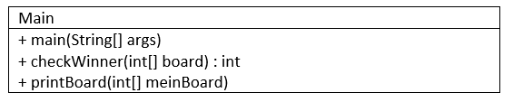
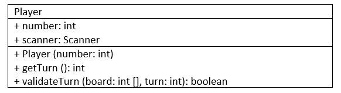

# Aufgabe 22) - TicTacToe 

### Klasse Main:

#### UML-Diagramm:

- **main(String[] args):**
  Initialisiert ein TicTacToe Spielfeld mit 9 Feldern und speichert in jedes Feld -1. 
- **checkWinner(int[] board): int**
  Überprüft die Gewinnsituationen eines TicTacToe und gibt den Gewinner zurück.
- **printBoard(int[] meinBoard)**
  Gibt das Spielfeld auf der Konsole aus.

### Klasse Player:

#### UML-Diagramm:

- **Konstruktor:**
  Weist number = number zu.
- **getTurn (): int:**
  Erstellt ein Scanner Objekt. Überprüft, wenn man außerhalb des Feldes, kommt eine Fehlermeldung. Bei einer Fehlermeldung ruft die Methode sich selbst auf. 
  
  **Tipp:** nach dem *if return* --> Sonst kommt man da nicht mehr raus.
- **validateTurn (board: int [], turn: int): boolean:**
  Überprüft wer dran ist
