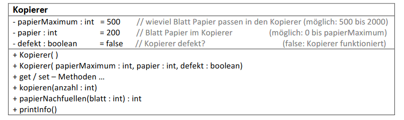
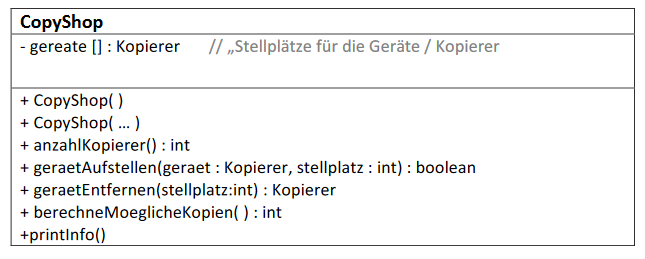

# Aufgabe 23 - Array – Assoziationen

### 1.) Es sind zwei Klassen zu erstellen:

- **Konstruktor:** In beiden Konstruktoren sind die set-Methoden zu verwenden.
- **set-Methoden:** Bei einem ungültigen Wert soll eine **Fehlermeldung** ausgegeben und der im
  UML-Diagramm angegebene **Standardwert** verwendet werden.
  papierMaximum darf **nur einmal gesetzt** und dann nicht mehr geändert werden!
  Auf gültige Werte für papier achten
- **kopieren(....):** Erstellt eine bestimmte Anzahl von Kopien (verringert papier entsprechend).
  Ist der Kopierer **defekt** oder wird eine **negative** oder eine **zu große Anzahl** angegeben, dann
  wird eine **Fehlermeldung** ausgegeben und **keine Kopie** erstellt.
- **papierNachfuellen(...):** Füllt den Papiervorrat des Kopierers soweit als möglich auf und gibt
  **die tatsächlich eingelegte Anzahl von Blättern zurück.** Bei einem **negativen Übergabewert**
  ist eine **Fehlermeldung** auszugeben und der **Rückgabewert ist 0.**
- **printInfo():** gibt die Daten des Kopierers in folgender Form aus:
> maximaler Papiervorrat: 500
>
> aktueller Papiervorrat: 200 (40.0%)
>
> einsatzbereit: ja

**Wichtig:** Prozentwert nicht vergessen und für einsatzbereit „ja“ oder „nein“ ausgeben!

Unser CopyShop besitzt eine maximale Anzahl Kopierer (Aufstellplätze).

- **Konstruktor:** Erzeugt ein leeres CopyShop (kein einziger Kopierer) das aber Stellplätze für
  z.B.: 4 Kopierer vorsieht.

- **Konstruktor:** Überlege Dir die Signatur für einen zweiten Konstruktor, dem eine maximale
  Anzahl von Geräten übergeben wird welche im Shop Platz finden und dem man optional
  auch gleich ein erstes Gerät mit übergeben kann.

- **geraetAufstellen(...):boolean** Der Übergabeparameter ***stellplatz*** gibt an, wo der Kopierer
  aufgestellt werden soll. Mögliche Werte sind 1,2,... bis Anzahl der Felder des Arrays. D.h.
  Stellplatz 1 → das Gerät wird dem ersten Feld des Arrays (geraete[0]) zugeordnet, usw.

  Zu prüfen ist:
> Wurde eine **Null-Referenz** übergeben?

> Ist **dieses Gerät schon** an irgend einem Stellplatz **vorhanden?**

> Ist an der gewünschten (gültigen?) Stelle **schon ein Gerät aufgestellt?**
  
  In allen diesen Fällen ist eine **entsprechende Fehlermeldung** auszugeben und false
  zurückzugeben! Im Erfolgsfall ist der Rückgabewert true.

- **geraetEntferenen(...):Kopierer** Entfernt das Gerät vom angegebenen Stellplatz und gibt das
  entfernte Objekt zurück (in Form einer Referenz auf das entfernte Kopierer-Objekt).
  Ist die Nummer des Stellplatzes ungültig oder der Stellplatz leer, wird eine entsprechende
  Fehlermeldung ausgegeben und der Rückgabewert ist eine *null*-Referenz.
 
- **anzahlKopierer():int** Gibt zurück wie viele Kopierer vorhanden sind.

- **berechneMoeglicheKopien():int** Es wird berechnet, **wie viele Kopien** in Summe mit allen
  *funktionierenden* Kopierern gemacht werden können und dieser Wert **zurückgegeben**.
  (D.h. wie viele Blätter Papier sind allen **funktionierenden** Kopierern vorhanden)

- **printInfo()** Gibt die Infos zu allen Kopierern in folgender Form aus:
> Kopierer 1:
> 
> maximaler Papiervorrat: 500
> 
> aktueller Papiervorrat: 200 (40%)
> 
> einsatzbereit: ja

> Kopierer 2:
> nicht vorhanden

> Kopierer 3:
nicht vorhanden

**Wichtig:** In keiner Methode darf eine NullPointerException auftreten, egal ob oder wie viele
Kopierer vorhanden sind.

### 2.) Erstelle eine Testklasse in der ...
- zwei Kopierer an von dir gewählten Stellplätzen im CopyShop aufgestellt werden.
- die Anzahl der möglichen Kopien berechnet und ausgegeben wird
- die *printInfo()*-Methode aufgerufen wird
- einer der vorhandenen Kopierer defekt wird
- noch einmal die Anzahl der möglichen Kopien berechnet und ausgegeben wird.
  Es sollte nun eine kleinere Zahl sein, außer der Papiervorrat des nun defekten
  Gerätes war auch schon vorher aufgebraucht.
