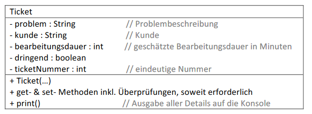
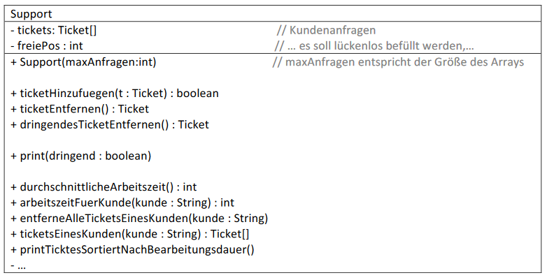

# Aufgabe 24) Array – Assoziationen - Sortieren

Dieses Beispiel geht von einer Firma aus, die technischen Support für ihre Kunden anbietet. Jede
Anfrage wird in Form eines „Tickets“ abgelegt. Es soll folgende Klassen geben:

### Klasse Ticket:

#### Vorgaben:

Überlege welche Überprüfungen erforderlich sind und welche Default-Werte sinnvoll sind.
Z.B.: Sind Texte bei den Attributen problem und kunde vorhanden bzw. viele Zeichen müssen diese
mindestens lang sein, ist der Wert für die Bearbeitungsdauer gültig,...

Die Ticketnummer soll in einem neu erstellten *Ticket*-Objekt zunächst immer 0 sein und wird erst
beim Hinzufügen in der *Support*-Klasse gesetzt.

### Klasse Support:

Alle Kundenanfragen werden in einem Array verwaltet. Hinzugefügt wird am Ende der
„Warteschlange“ (an der ersten freien Position), bearbeitet und damit entfernt wird das Ticket
normalerweise an der vordersten Stelle (entspricht einer: Warteschlange / Queue / **F**irst**I**n**F**irst**O**ut).

#### Vorgaben:

**ticketHinzufuegen(...) : boolean**
Das als Parameter übergebene Ticket wird hinzugefügt, sofern noch ein Feld im Array frei ist.
Dabei wird dessen Ticketnummer auf einen noch nicht vorhandenen, eindeutigen Wert gesetzt.
Das kann man z.B. so realisieren, dass man die größte schon vorhandene Ticketnummer sucht und
einen um 1 höheren Wert vergibt. Ist gerade kein Ticket in der Warteschlange enthalten, dann wird
die Nummer 1 vergeben.

**Rückgabewert:** *true* bei erfolgreichem Hinzufügen, andernfalls *false* (auch bei Übergabe von *null*)

**ticketEntfernen(...): Ticket**
Es wird das erste Ticket im Array (jenes, das sich am längsten in der Warteschlang befindet) entfernt,
alle anderen rücken nach.

**Rückgabewert:** eine Referenz auf das entfernte Objekt oder
null, wenn die Warteschlange (das Array tickets) leer ist

**dringendesTicketEntfernen(...):**
Wie bei der vorherige Methode wird ein Ticket entfernt, aber nicht das erste Ticket im Array,
sondern das **erste dringende** Ticket.

**Rückgabewert:** eine Referenz auf das entfernte Objekt oder
null, wenn es kein dringendes Ticket mehr gibt

**print(dringend : boolean):**
Gibt Tickets aus, dringend==true ... es werden nur die dringenden Tickets ausgegeben,
dringend==false ... es werden alle Tickets ausgegeben

**durchschnittlicheArbeitszeit():**
Berechnet wieviel Zeit durchschnittlich für die Bearbeitung eines Tickets vorgesehen ist.

**arbeitszeitFuerKunde(kunde : String):**
Berechnet die geschätzte Zeit für die Bearbeitung aller Tickets eines bestimmten Kunden. Beachte,
dass Textvergleiche nicht mit == sondern stets mit Hilfe der *equals()*-Methode erfolgen sollen.

**entferneAlleTicketsEinesKunden(kunde : String):**
Entfernt alle Tickets eines bestimmten Kunden. Dazu eventuell eine Hilfsmethode schreiben, welche
das erste Ticket eines bestimmten Kunden sucht und entfernt, als Rückgabewert true oder false
liefert und diese Methode so lange aufrufen, bis sie eine negative Rückmeldung liefert.

### Etwas aufwendigere Methoden:

**ticketsEinesKunden(kunde : String) : Ticket[]**
Gibt ein Array zurück, dass nur Tickets eines bestimmten Kunden enthält (genauer gesagt: ein Array
von Referenzen auf Tickets dieses Kunden). Zur Bestimmung der erforderlichen Größe des
zurückzugebenden Arrays vorher die Anzahl der Ticktes dieses Kunden zählen!

**printTicketsSortiertNachBearbeitungsdauer()**
Gibt alle Tickets sortiert nach der geschätzten Bearbeitungsdauer aus. Das Ticket mit der größten Dauer soll zuerst ausgegeben werden.

**Achtung:** Die Warteschlange darf **nicht** verändert werden. Der Sortieralgorithmus muss daher mit
einer Kopie des originalen Arrays arbeiten.
