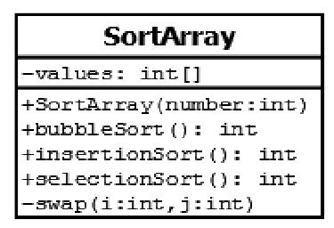
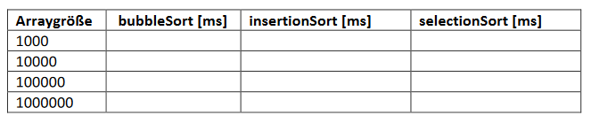

# Aufgabe 26) - Sortieren Vergleichen 

#### Sortieren: Bubble-Sort, Insertion-Sort, Selection-Sort.
Die angegebenen drei Sortierverfahren sollen miteinander verglichen werden. Den Bubble-sort und
die swap-Methode haben wir schon im Theorieunterricht besprochen und auch implementiert.
Versuchen Sie anhand der Vorgabe (Java-Programm: Sortierverfahren) auch die beiden anderen
Sortierverfahren zu implementieren und zu vergleichen.

### Todo:
- **SortArray()** – initialisiert das Array mit Anzahl **number** Zufallszahlen.
- **bubbleSort()** – Realisiert den Bubble-Sort und gibt die gemessene Zeit zurück.
- **insertionSort()** - Realisiert den Insertion-Sort und gibt die gemessene Zeit zurück.
- **selectionSort()** - Realisiert den Selection-Sort und gibt die gemessene Zeit zurück.
- **swap(i:int, j:int)** – Vertauscht die beiden Zahlen values[i] und values[j].
- Vergleichen Sie die Sortierverfahren für folgende Arraygrößen:
  1000, 10000, 100000, 1000000. Die ermittelten Werte schreiben Sie dann in eine Tabelle, die
  wie folgt aussehen soll:
  
  
